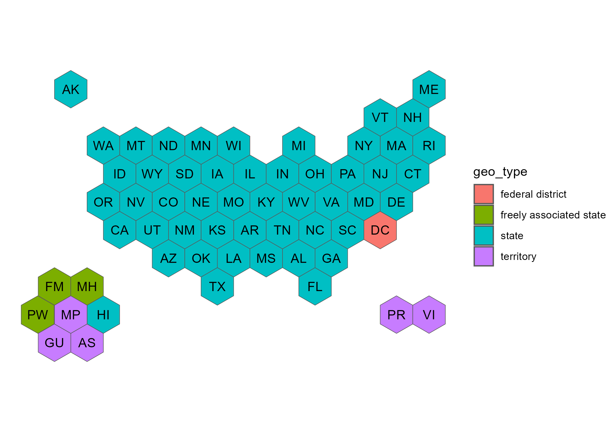
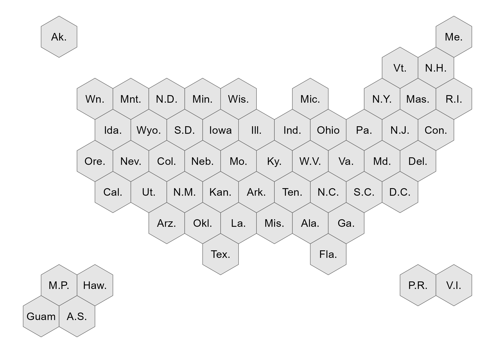
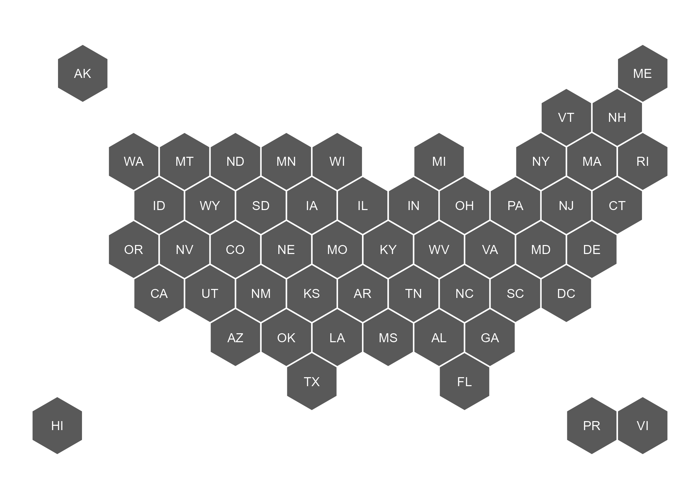

# usahex

This is a simple packages that includes hex maps of the United States with multiple options of different geographies.  Other hex maps available for public use only have the 50 states + DC: [R Graph Gallery](https://r-graph-gallery.com/328-hexbin-map-of-the-usa.html) and [Datawrapper](https://www.datawrapper.de/basemaps/usa-states-hexagons.html).  The [CDC Open-Source Visualization Editor (COVE)](https://www.cdc.gov/cove/data-visualization-types/hex-map.html) puts hexagons in a line at the bottom of the 50 states + DC hex map to account for territories and freely associated states. However, the coordinates provided in the [json file available on cdc-open-vis GitHub](https://github.com/CDCgov/cdc-open-viz/blob/main/packages/map/src/components/UsaMap/data/us-hex-topo.json) only has the 50 states + DC.


**The benefit of the usahex is that it includes hex maps with territories and freely associated states.**


*Why hex maps?*

- clear way to display information on a geography basis 
- most choropleth maps are not using metrics related to land size; traditional lat/long maps over-emphasize large-land geographies and under-emphasize small-land geographies 
- hex maps allow enough space for each geography to have id label and value label 


## R Installation 

usahex uses the [sf](https://r-spatial.github.io/sf/) package (sf = simple features) to create shape objects that are easy to plot using the [ggplot2](https://ggplot2.tidyverse.org/) package, my preferred medium for data visualizations.    

```{r, eval = FALSE}
# install.packages("devtools")
devtools::install_github("mareichler/usahex")
```

## Getting Started 

```{r, message = FALSE, warning = FALSE}
library(usahex)
library(ggplot2)
```


```{r}
allgeos <- get_coordinates(map = "usa59", coords = "hexmap") |> 
  ggplot() + 
  geom_sf(aes(fill = geo_type)) + 
  geom_sf_text(aes(label = abbr_usps), size = 3.5) + 
  theme_void()
```

```{r, eval = FALSE, echo = TRUE}
allgeos
```

```{r, eval = TRUE, echo = FALSE, message = FALSE}
# need to do this so that it shows up in pkgdown website 
# https://github.com/r-lib/pkgdown/issues/133
ggsave(filename = "man/figures/example_map_showing_all_geos.png", plot = allgeos)
```

 

## Don't Use R? 

### geojson files 

These files can be found in the [data-raw/geojson](https://github.com/MarEichler/usahex/tree/main/data-raw/geojson) folder on GitHub. 

```{r}
geojson <- "https://raw.githubusercontent.com/MarEichler/usahex/refs/heads/main/data-raw/geojson/usa56.geojson"
```

```{r}
df <- sf::read_sf(geojson) 

gggeojson <- ggplot(df) + 
  geom_sf() +
  geom_sf_text(aes(label = abbr_gpo), size = 3) + 
  theme_void()
```

```{r, eval = FALSE, echo = TRUE}
gggeojson
```

```{r, eval = TRUE, echo = FALSE, message = FALSE}
# need to do this so that it shows up in pkgdown website 
# https://github.com/r-lib/pkgdown/issues/133
ggsave(filename = "man/figures/geojson_example_map.png", plot = gggeojson)
```

 


### CVS Files 

These files can be found in the [data-raw/csv](https://github.com/MarEichler/usahex/tree/main/data-raw/csv) folder on GitHub.   


```{r}
csv <- "https://raw.githubusercontent.com/MarEichler/usahex/refs/heads/main/data-raw/csv/usa53.csv"
read.csv(csv)[1:14,c(2,6, 10:13)]
```

The `X` and `Y` coordinates are the 7 coordinates for each state that create the hexagon.  The `cX` and `cY` are repeated center coordinates that create a single point in the center of the given hexagons. These raw files can also be used to create ggplot2 items if you don't want to work with simple features (sf) objects: 

```{r}
df <- read.csv(csv) 

# only need 1coord per state
labels <- dplyr::distinct(dplyr::select(df, -c(X, Y)))

ggcsv <- ggplot(df, aes(group=abbr_usps)) +
  geom_polygon(aes(x=X, y=Y), color = "white", fill = "grey35") +
  geom_text(
    data=labels, 
    aes(label=abbr_long, x = cX, y = cY), 
    size = 3, 
    color = "white"
  ) +
  coord_fixed() + 
  theme_void() 
```

```{r, eval = FALSE, echo = TRUE}
ggcsv
```

```{r, eval = TRUE, echo = FALSE, message = FALSE}
# need to do this so that it shows up in pkgdown website 
# https://github.com/r-lib/pkgdown/issues/133
ggsave(filename = "man/figures/csv_example_map.png", plot = ggcsv)
```

 


## Original Coordinates Source  


Back during covid times, [NPR used hex maps (that included US territories)](https://www.npr.org/2021/12/27/1068303629/covid-19-omicron-maps-data-states) to show different covid related metrics.  I reached out to [Alyson Hurt, Supervising Graphics Editor](https://www.npr.org/people/348735573/alyson-hurt) who pointed me to the [dailygraphics-templates file on GitHub](https://github.com/nprapps/dailygraphics-templates/blob/129967a4ae36f14cf299f434f9814f7314a00cde/state_grid_map/index.html#L49-L110) that contained the coordinates for the map.  I've made some small adjustments, moving some of the pacific island hexagons around and adding new hexagons to account for freely associated states; but these coordinates are the basis for all of the maps in this package.  The y values have been reversed so that the plot is not upside down. 