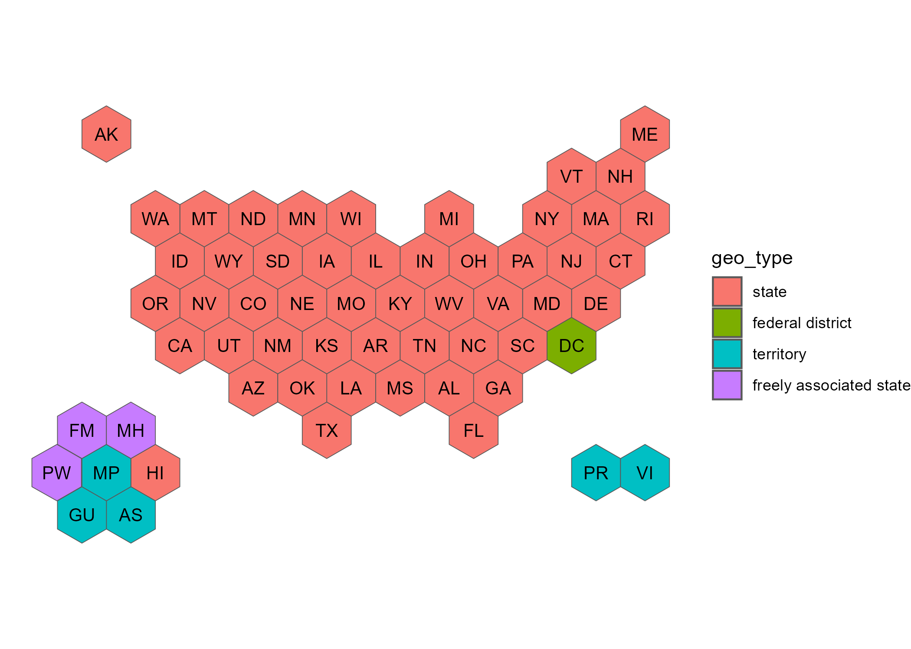

# usahex

This is a simple packages that includes hex maps of the United States with multiple options of different geographies.  The only other hexmap coordinates of the United States that are easily available only include the 50 states and DC: [R Graph Gallery](https://r-graph-gallery.com/328-hexbin-map-of-the-usa.html) and [Datawrapper](https://www.datawrapper.de/basemaps/usa-states-hexagons.html).  

However, this ignores territories (also referred to as outlying areas) and freely associated states.  The [CDC Open-Source Visualization Editor (COVE)](https://www.cdc.gov/cove/data-visualization-types/hex-map.html) addresses this by putting hexagons in a line at the bottom of the widly used 50 states + DC hex map. Although, I was unable to provide 'coordinates' that include these hexagons at the bottom; the [json file available on cdc-open-vis GitHub](https://github.com/CDCgov/cdc-open-viz/blob/main/packages/map/src/components/UsaMap/data/us-hex-topo.json) mirrored the R Graph Gallery version (50 states + DC).


## Benefits of this package

- includes hex maps **with** territories and freely associate states
- simple hexagon coordinates (not based on lat/long coordinates): which makes it much easier to add/subtract/move hexagons so if you want a map with different permutations, you can make it yourself! 


## WHY? 

Hex maps are much better when displaying information on a state-by-state basis.  Most of the US choropleth maps are not using metrics that relate to land size, so there is no need to use a traditional lat/long map.  Traditional maps over emphasis large-land geographies and makes small-land geographies difficult to see.   

Hex maps are easier for displaying data on a unique state basis and allow for enough space to put actual values on the map FOR EVERY GEOGRAPHY (not just the large-land geographies)


## Original Coordinates Source  


Back during covid times, [NPR used hex maps (that included US territories)](https://www.npr.org/2021/12/27/1068303629/covid-19-omicron-maps-data-states) to show different covid related metrics.  I reached out to [Alyson Hurt, Supervising Graphics Editor](https://www.npr.org/people/348735573/alyson-hurt) who pointed me to the [dailygraphics-templates file on GitHub](https://github.com/nprapps/dailygraphics-templates/blob/129967a4ae36f14cf299f434f9814f7314a00cde/state_grid_map/index.html#L49-L110) that contained the coordinates for the map.  I've made some small adjustments, moving some of the pacific island hexagons around and adding some new ones; but these coordinates are the basis for all of the maps in this package.  The y values have been reversed so that the plot is not upside down. 


## R Installation 

The packages uses [sf](https://r-spatial.github.io/sf/) package (sf = simple features) to create shape objects that are easy to plot using the [ggplot2](https://ggplot2.tidyverse.org/) package, my preferred medium for data visualizations.    

```{r, eval = FALSE}
# install.packages("devtools")
devtools::install_github("mareichler/usahex")
```

## Hex Maps 

| geos / map name |`usa50`|`usa51`|`usa52`|`usa53`|`usa56`|`usa59`|`usaETA`/`ETAregions`| 
|:------------    |:-----:|:-----:|:-----:|:-----:|:-----:|:-----:|:-----:|
| 50 states       | X     | X     | X     | X     | X     | X     | X     |
| District of Columbia | -| X     | X     | X     | X     | X     | X     |
| Puerto Rico     | -     | -     | X     | X     | X     | X     | X     |
| U.S. Virgin Islands  | -| -     | -     | X     | X     | X     | X     |
| Guam                 | -| -     | -     | -     | X     | X     | X     |
| American Samoa       | -| -     | -     | -     | X     | X     | X     |
| Northern Mariana Islands| -| -  | -     | -     | X     | X     | X     |
| Palau                | -| -     | -     | -     | -     | X     | X     |
| Micronesia           | -| -     | -     | -     | X     | X     | -     |
| Marshall Islands     | -| -     | -     | -     | X     | X     | -     |


```{r, message = FALSE, warning = FALSE}
library(usahex)
library(ggplot2)
```


```{r}
allgeos <- get_coordinates(map = "usa59", coords = "hexmap") |> 
  ggplot() + 
  geom_sf(aes(fill = geo_type)) + 
  geom_sf_text(aes(label = abbr_usps)) + 
  theme_void()
```

```{r, eval = FALSE, echo = TRUE}
allgeos
```

```{r, eval = TRUE, echo = FALSE, message = FALSE}
# need to do this so that it shows up in pkgdown website 
# https://github.com/r-lib/pkgdown/issues/133
ggsave(filename = "man/figures/example_map_showing_all_geos.png", plot = allgeos)
```




## Don't Use R? 


### CVS Files 

These files can be found in the [data-raw](https://github.com/MarEichler/usahex/tree/main/data-raw) folder on GitHub.   


```{r}
csv <- "https://raw.githubusercontent.com/MarEichler/usahex/refs/heads/main/data-raw/usa53.csv"
read.csv(csv)[1:14,]
```

The `X` and `Y` coordinates are the 7 coordinates for each state that create the hexagon.  The `cX` and `cY` are repeated center coordinates that create a single point in the center of the given hexagons.  

These raw files can also be used to create ggplot2 items if you don't want to work with simple features (sf) objects: 

```{r}
df <- read.csv("https://raw.githubusercontent.com/MarEichler/usahex/refs/heads/main/data-raw/usa53.csv") 


gg <- ggplot(df, aes(group=abbr_usps)) +
  geom_polygon(aes(x=X, y=Y), color = "white", fill = "grey35") +
  geom_text(
    data=dplyr::distinct(df, abbr_usps, cX, cY), # only need 1coord per state
    aes(label=abbr_usps, x = cX, y = cY), 
    size = 3.25, 
    color = "white"
  ) +
  coord_fixed() + 
  theme_void() 
```

```{r, eval = FALSE, echo = TRUE}
gg
```

```{r, eval = TRUE, echo = FALSE, message = FALSE}
# need to do this so that it shows up in pkgdown website 
# https://github.com/r-lib/pkgdown/issues/133
ggsave(filename = "man/figures/csv_example_map.png", plot = gg)
```


