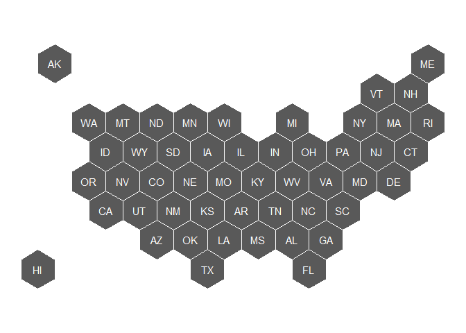
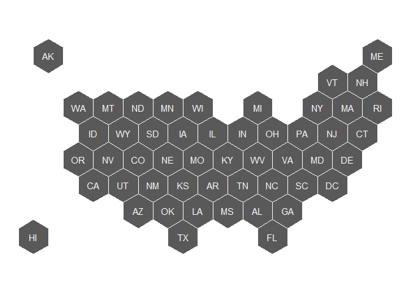
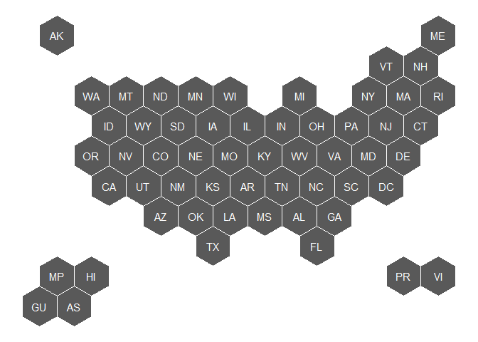
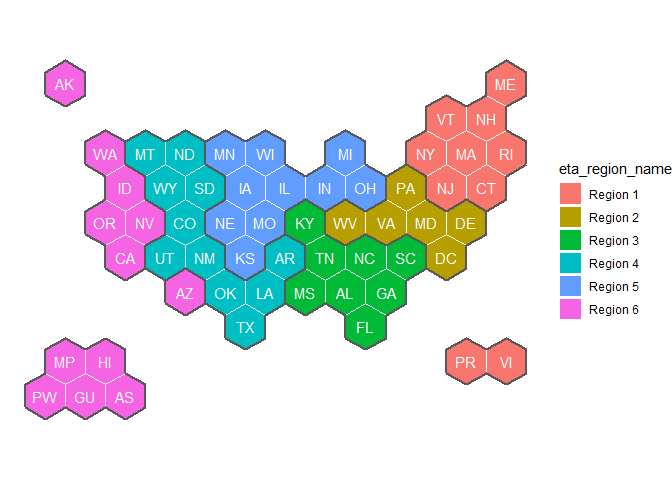

# usahex

US Hex Map with just States:
[r-graph-gallery.com/hexbin-map](https://www.r-graph-gallery.com/hexbin-map)

I’ve copied the coordinates from the NPR Graphics team:
[github.com/nprapps/dailygraphics-templates](https://github.com/nprapps/dailygraphics-templates/blob/master/state_grid_map/index.html).
The y values have been reversed so that the plot is not upside down.

# Available Maps

``` r
library(tidyverse)
library(usahex)
```

## `states50`

50 US states only

``` r
get_coordinates(map = "states50", coords = "hexmap") |> 
  ggplot() + 
  geom_sf(fill = "grey35", color = "white") + 
  geom_sf_text(
    data = get_coordinates("states50", "labels"), 
    aes(label = abbr_usps), color = "white") + 
  theme_void()
```

<!-- -->

## `statesDC`

50 US States and District of Columbia (DC)

``` r
get_coordinates(map = "statesDC", coords = "hexmap") |> 
  ggplot() + 
  geom_sf(fill = "grey35", color = "white") + 
  geom_sf_text(
    data = get_coordinates("statesDC", "labels"), 
    aes(label = abbr_usps), color = "white") + 
  theme_void()
```

<!-- -->

## `statesTerr`

50 US States, District of Columbia (DC), Puerto Rico, Virgin Islands,
American Samoa, and the Marshall Islands

``` r
get_coordinates(map = "statesTerr", coords = "hexmap") |> 
  ggplot() + 
  geom_sf(fill = "grey35", color = "white") + 
  geom_sf_text(
    data = get_coordinates("statesTerr", "labels"), 
    aes(label = abbr_usps), color = "white") + 
  theme_void()
```

<!-- -->

## `WIOAETA` and `WIOAETAregions`

50 US States, District of Columbia (DC), Puerto Rico, Virgin Islands,
American Samoa, the Marshall Islands, and Palau.

WIOA: Workforce Innovation and Opportunity (workforce dev.
legislation)  
ETA: Department of Labor’s Employment and Training Administration

The [ETA regions](https://www.dol.gov/agencies/eta/regions) will rarely
be plotted on their own, but they are nice to add as a border to group
states in the same region together.

``` r
get_coordinates(map = "WIOAETA", coords = "hexmap") |> 
  ggplot() + 
  geom_sf(aes(fill = eta_region_name), color = "white") + 
  geom_sf(data = get_coordinates("WIOAETAregions", "hexmap"), 
          fill = NA, color = "grey35", linewidth = 1) + 
  geom_sf_text(
    data = get_coordinates("WIOAETA", "labels"), 
    aes(label = abbr_usps), color = "white") + 
  theme_void()
```

<!-- -->
