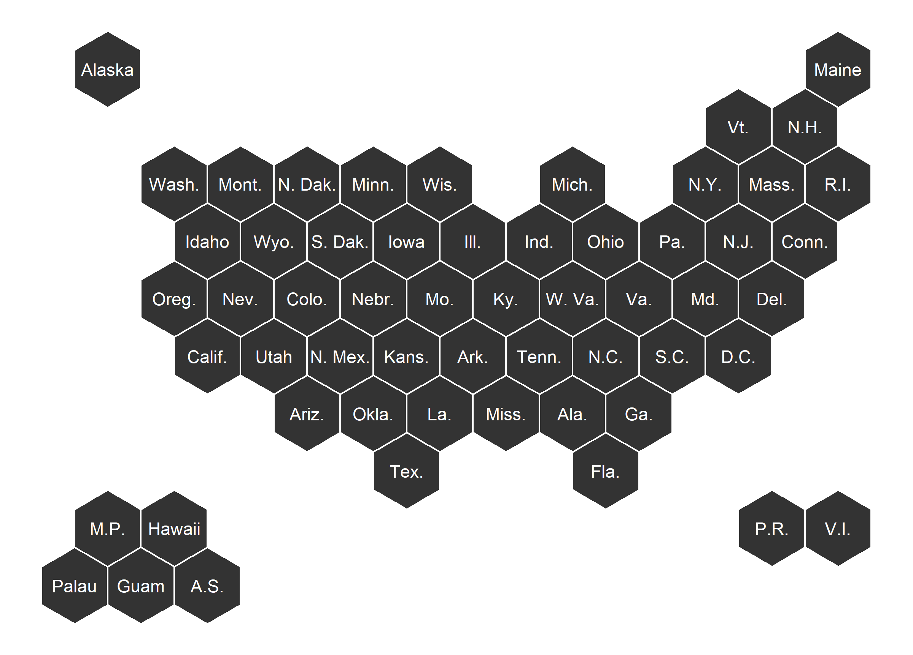

# US Hex Map (States and Territories)

US Hex Map with just States: [r-graph-gallery.com/hexbin-map](https://www.r-graph-gallery.com/hexbin-map)

I've copied the coordinates from the NPR Graphics team: [github.com/nprapps/dailygraphics-templates/blob/master/state_grid_map/index.html](https://github.com/nprapps/dailygraphics-templates/blob/master/state_grid_map/index.html)

# State and Territories 

This map is an 'exact' copy of the NPR graphics team's hex map.  (I had to reverse the y values to have the plot not be upside down).  

# State and Territories Plus

This map adds Palau to the map.  

