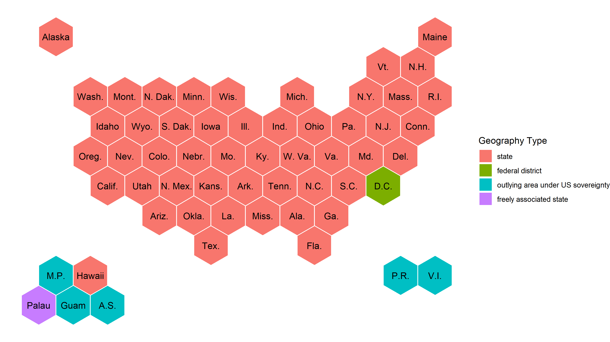
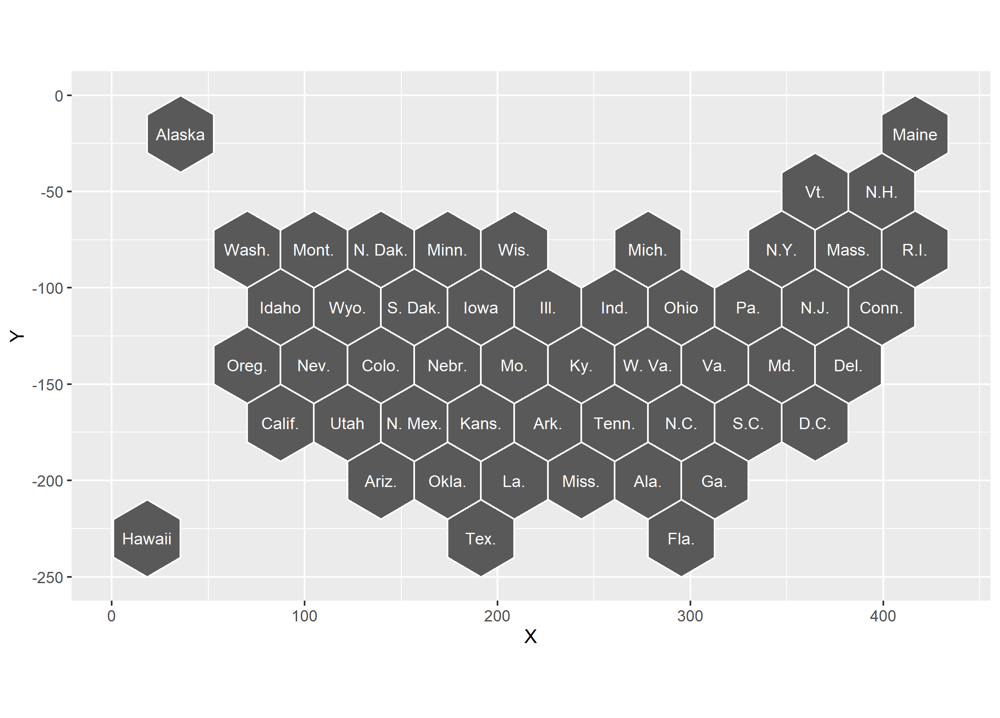

# US Hex Map

US Hex Map with just States: [r-graph-gallery.com/hexbin-map](https://www.r-graph-gallery.com/hexbin-map)


I've copied the coordinates from the NPR Graphics team: [github.com/nprapps/dailygraphics-templates](github.com/nprapps/dailygraphics-templates/blob/master/state_grid_map/index.html). The y values have been reversed so that the plot is not upside down.  

# Available Maps



| Name | Geography Types Included | Description | 
|:----- |:------|:-------------|
| States | - states<br>- federal district | This is a direct copy of the NPR state map. | 
| States and Outlying Areas | - states<br>- federal district<br>- outlying areas (territories) | This is a direct copy of the NPR state and outlying areas map. | 
| WIOA ETA | - states<br>- federal district<br>- outlying areas (territories)<br>- Palau | - WIOA: Workforce Innovation and Opportunity (workforce dev. legislation)<br>- ETA: Department of Labor's Employment and Training Administration<br>- Palau is added to the map as Palau is included in [ETA regions](https://www.dol.gov/agencies/eta/regions)<br>- To add Palau, change the location of Guam and American Samoa  |

# Plotting with Different File Types 

```r
library(ggplot2)
```

## 1. RDS Files

```r
states        <- readRDS("data/states/1_rds/states.RDS")
states_labels <- readRDS("data/states/1_rds/states_labels.RDS")

ggplot(states) + 
  geom_sf(color = "white", fill = "grey35") + 
  geom_sf_text(data=states_labels, aes(label=abb_gpo), size = 3.25, color = "white") + 
  theme_void()
```
  

## 2. Shape Files 

```r
states        <- sf::read_sf("../data/states/2_shp/states.shp")
states_labels <- sf::read_sf("../data/states/2_shp/states_labels.shp")

ggplot(states) + 
  geom_sf(color = "white", fill = "grey35") + 
  geom_sf_text(data=states_labels, aes(label=abb_gpo), size = 3.25, color = "white") + 
  theme_void()
```

  

## 3. CSV (fortified)

```r
states        <- readr::read_csv("../data/states/3_csv/states.csv"       , show_col_types = FALSE)
states_labels <- readr::read_csv("../data/states/3_csv/states_labels.csv", show_col_types = FALSE)

ggplot(states, aes(x=X, y=Y, group=id)) + 
  geom_polygon(color = "white", fill = "grey35") + 
  geom_text(data=states_labels, aes(label=abb_gpo), size = 3.25, color = "white") + 
  coord_fixed() + #don't use coord_map(), only coord_fixed()
  theme_void()
```

  

# Plot with Additional Data 

```{r}
library(tidyverse)
library(sf)

wioa_eta        <- readRDS("data/wioa_eta/1_rds/wioa_eta.RDS")
wioa_eta_labels <- readRDS("data/wioa_eta/1_rds/wioa_eta_labels.RDS")

#estimated population change, 2010-2020
#data taken from Wikipedia on 2021-01-14
#source: https://en.wikipedia.org/wiki/List_of_states_and_territories_of_the_United_States_by_population
other_data <- read_csv("data/population_change.csv", show_col_types = FALSE) %>%
  mutate(
      pop_change = str_replace(pop_change, "%", "")
    , pop_change = str_replace(pop_change, "–", "-")
    , pop_change = as.numeric(pop_change)/100
  )

combined        <- left_join(wioa_eta,        other_data, by = c("abb_usps"="code"))
combined_labels <- left_join(wioa_eta_labels, other_data, by = c("abb_usps"="code"))

NA_color <- "grey80"

ggplot(combined) + 
  geom_sf(aes(fill = pop_change),     color = NA       ) +  #color (non-NA) hex
  geom_sf(    fill = NA,          aes(color = "NA")    ) +  #dummy legend for NA values 
  geom_sf(    fill = NA,              color = "grey50" ) +  #hex borders 
  geom_sf_text(
    data=mutate(combined_labels, geometry=geometry+c(0, 5))
    , aes(label=abb_usps)
    , fontface="bold"
    , size=3.25
  ) + 
  geom_sf_text(
    data=mutate(combined_labels, geometry=geometry+c(0,-5))
    , aes(label=scales::percent(pop_change, accuracy=0.1))
    , size=2.75
  ) + 
  scale_fill_gradient2(
    name = "Population\nChange"
    , low  = RColorBrewer::brewer.pal(3, "PiYG")[1]
    , mid  = RColorBrewer::brewer.pal(3, "PiYG")[2]
    , high = RColorBrewer::brewer.pal(3, "PiYG")[3]
    , midpoint = 0
    , labels = scales::percent
    , na.value = NA_color
  ) + 
  scale_color_manual( #dummy legend for NA color 
      name = NULL
    , values = NA_color
    , labels = 'No data'
  ) +
  guides(
      fill  = guide_colorbar(order = 1)
    , color = guide_legend(override.aes = list(fill =NA_color))
  ) +
  labs(
      title = "Population Change, 2010 - 2020"
    , caption = paste(
        c(
        "Source:",
        "en.wikipedia.org/wiki/List_of_states_and_territories_of_the_United_States_by_population",
        "as of January 14, 2021"
        ), 
        collapse="\n")
  ) +
  theme_void()
```
  
