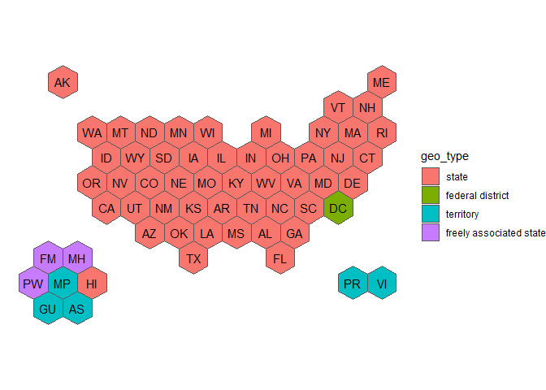

# usahex

## Installation

``` r
# install.packages("devtools")
devtools::install_github("mareichler/usahex")
```

## Hex Maps

<!--                      |50 states| DC | PR | VI | GU | AS | MP | PW |  -->

| map name / geos include | 50 states | District of Columbia | Puerto Rico | U.S. Virgin Islands | Guam | American Samoa | Northern Mariana Islands | Palau |
|:---|:--:|:--:|:--:|:--:|:--:|:--:|:--:|:--:|
| usa50 | X | \- | \- | \- | \- | \- | \- | \- |
| usa51 | X | X | \- | \- | \- | \- | \- | \- |
| usa52 | X | X | X | \- | \- | \- | \- | \- |
| usa53 | X | X | X | X | \- | \- | \- | \- |
| usa56 | X | X | X | X | X | X | X | \- |
| usaETA | X | X | X | X | X | X | X | X |
| ETAregions\* | x | x | x | x | x | x | x | x |

\* *Note:* Does not include individual geography hexagons, combines
hexagons to create grouped regions of hexagons.

The original source of the coordinates are from the NPR Graphics team:
[github.com/nprapps/dailygraphics-templates](https://github.com/nprapps/dailygraphics-templates/blob/129967a4ae36f14cf299f434f9814f7314a00cde/state_grid_map/index.html#L50-L110).
The y values have been reversed so that the plot is not upside down.

``` r
library(usahex)
library(tidyverse)
```

``` r
get_coordinates(map = "usaETA", coords = "hexmap") |> 
  ggplot() + 
  geom_sf(aes(fill = geo_type)) + 
  geom_sf_text(aes(label = abbr_usps)) + 
  theme_void()
```

<!-- -->

## Don’t Use R?

Have no fear! I saved a csv of each map with the coordinates. These
files can be found in the data-raw folder on github.
